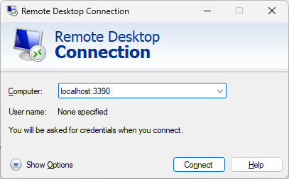
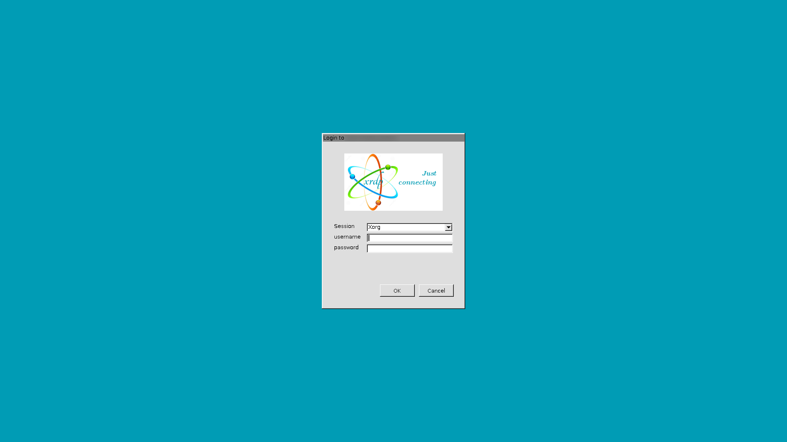
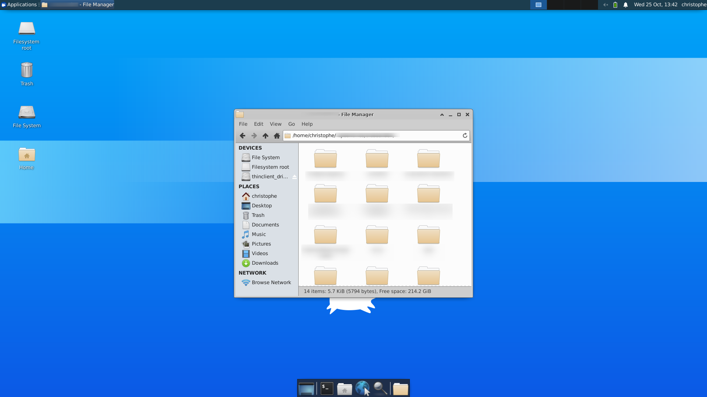

<!-- This file has been generated by the concat.sh script. -->
<!-- Don't modify this file manually (you'll loose your changes) -->
<!-- but run the tool once more -->
<!-- Last refresh date: Thursday, October 26, 2023, 16:46:49 -->

<!-- markdownlint-disable MD033 MD041 -->

# Docker &amp; docker-compose tips


> List of tips and tricks for Docker

<!-- table-of-contents - start -->
* [Some useful bash scripts](#some-useful-bash-scripts)
  * [Check container](#check-container)
    * [Check the container exists (independently of the status)](#check-the-container-exists-independently-of-the-status)
    * [Return only the ID](#return-only-the-id)
  * [Healthcheck - Get the status of all running containers](#healthcheck-get-the-status-of-all-running-containers)
* [PHP](#php)
  * [Minimal Dockerfile for PHP projects](#minimal-dockerfile-for-php-projects)
    * [Copy or using a volume?](#copy-or-using-a-volume)
  * [The easiest way to run a PHP snippet](#the-easiest-way-to-run-a-php-snippet)
* [Tips](#tips)
  * [Using Dockerfile or put it in a script?](#using-dockerfile-or-put-it-in-a-script)
  * [Docker outside of Docker (aka DooD)](#docker-outside-of-docker-aka-dood)
    * [Tips for Dood](#tips-for-dood)
  * [Run an inline script](#run-an-inline-script)
  * [How to generate a graph from docker-compose.yml](#how-to-generate-a-graph-from-docker-compose-yml)
  * [Folders location under WSL2](#folders-location-under-wsl2)
  * [Docker inspect and filter the output](#docker-inspect-and-filter-the-output)
  * [NPM - Folder node_modules](#npm-folder-node-modules)
  * [Add this folder in the PATH so npm can retrieve it from there](#add-this-folder-in-the-path-so-npm-can-retrieve-it-from-there)
  * [RUN ln -s /opt/node_app/node_modules node_modules](#run-ln-s-opt-node-app-node-modules-node-modules)
  * [Using regex in conditional statements](#using-regex-in-conditional-statements)
  * [Opening a RDP connection to the Linux local instance](#opening-a-rdp-connection-to-the-linux-local-instance)
    * [Get the desktop environment](#get-the-desktop-environment)
  * [check xrdp status (optional)](#check-xrdp-status-optional)
  * [Storing secrets](#storing-secrets)<!-- table-of-contents - end -->

## Some useful bash scripts

### Check container

Let's imagine the `sonarqube` container.

#### Check the container exists (independently of the status)

```bash
docker ps -a -f name=sonarqube
```

Will return 

```text
CONTAINER ID   IMAGE              COMMAND                  CREATED      STATUS              PORTS                    NAMES
422f62c2fc23   sonarqube:latest   "/opt/sonarqube/dock…"   4 days ago   Up About a minute   0.0.0.0:9000->9000/tcp   sonarqube
```

or

```text
CONTAINER ID   IMAGE              COMMAND                  CREATED      STATUS                       PORTS     NAMES
422f62c2fc23   sonarqube:latest   "/opt/sonarqube/dock…"   4 days ago   Exited (130) 3 seconds ago             sonarqube
```

As we can see, the `docker ps` command will return our container but, perhaps, did we make sure the container is running:

```bash
docker ps -a -f name=sonarqube -f status=running
```

#### Return only the ID

The `-q` flag means `qiet` and will only return the ID:


```bash
docker ps -a -q -f name=sonarqube
```

This will return only the `ID`, like `22f62c2fc23`.

### Healthcheck - Get the status of all running containers

Loop all running containers and return the health status of each of them.

Idea is to have a very condensed summary with the container name and the status

```bash
clear

printf "%s\n\n" "Docker containers - Health check"

containers=$(docker ps | awk '{if(NR>1) print $NF}')

for container in $containers; do
    status=$(docker inspect --format='{{json .State.Health}}' $container | jq -r '.Status')

    if [[ "$status" == "healthy" ]]; then
        status="${status}"
    elif [[ "$status" == "null" ]]; then
        status="${status}"
    else
        status="${status}"
    fi

    printf "%-60s%s\n" "$container" "$status"
done
```

The output will be something like this:

```text
Docker containers - Health check

jovial_heisenberg                                           healthy
boring_wozniak                                              healthy
furious_einstein                                            healthy
loving_goldstine                                            healthy
agitated_darwin                                             healthy
jovial_yalow                                                healthy
ecstatic_almeida                                            healthy
furious_heisenber                                           healthy
```

Same result, another syntax:

```bash
clear

printf "%s\n\n" "Docker containers - Health check"

docker ps -a --format "{{.Names}}" | while read -r container ; do
    healthcheckStatus=$(docker inspect --format='{{json .State.Health}}' $container | jq -r '.Status')

    if [[ "$healthcheckStatus" == "healthy" ]]; then
        healthcheckStatus="${healthcheckStatus}"
    elif [[ "$healthcheckStatus" == "null" ]]; then
        healthcheckStatus="${healthcheckStatus}"
    else
        healthcheckStatus="${healthcheckStatus}"
    fi

    printf "%-60s%s\n" "$container" "$healthcheckStatus"
done
```

## PHP

### Minimal Dockerfile for PHP projects

Imagine a small script like [https://github.com/cavo789/json_encode](https://github.com/cavo789/json_encode).

There is no dependencies to any services like MySQL or PostgreSQL.

Such application can be easily put in a Docker container using this `Dockerfile`:

```text
FROM php:8.0-apache
WORKDIR /var/www/html
EXPOSE 80
```

1. Create a new file called `Dockerfile` in your application root and copy the lines here above in the file.
2. Build your application Docker image by running `docker build --pull --rm -t appName:latest .` where `appName` can be anything you want.
3. Run `docker run -p 80:80 -d -v %cd%:/var/www/html --name appName appName`
4. Start your browser and surf to `http://127.0.0.1` to start your application.

#### Copy or using a volume?

By running `docker run -p 80:80 -d -v %cd%:/var/www/html --name appName appName` i.e. using the `-v` parameter, you'll set a volume i.e. you'll synchronize a folder on your host (`%cd` means the current directory in DOS) to a folder in your container (here, the folder `/var/www/html`).

This means that if you change a file, the change is reflected in the container or vice-versa (if you delete a file in the container, it's deleted on your host too).

If you don't want a synchronization, don't use the `-v` parameter and uncomment the `COPY . .` line in the `Dockerfile`.

The `COPY . .` statement order to make a copy of all files present in your host current directory (and sub-directories) inside the container. There will be no synchronization: you can't change a file on your host and hope the change is done in the container too. And files created, modified or even deleted in the container stays in the container; just like a *sandbox*.

### The easiest way to run a PHP snippet

The situation: you wish to run a piece of standard PHP code (no dependency) like the one below:

```php
<?php

echo "<h2>Incorrect, silent bug</h2>";

print_r(json_decode(utf8_decode("Ipso lorem"), true));

echo "<h2>Incorrect, we got an exception</h2>";

print_r(json_decode(utf8_decode("Ipso lorem"), true, 512, JSON_THROW_ON_ERROR));
```

The easiest way is to:

* Create a temporary directory like `mkdir /tmp/snippet && /tmp/snippet`,
* Create an `index.php` file there (with your snippet like here above),
* Run this command in the console: `docker run -d -p 8080:80 -u ${UID}:${GID} -v "$PWD":/var/www/html php:7.4-apache` and,
* Surf to `http://127.0.0.1:8080`.

It's done.

Explanations for the `docker run -d -p 8080:80 -v "$PWD":/var/www/html php:7.4-apache` command:

* We wish to make the local website accessible on port 8080 (so `http://127.0.0.1:8080`),
* We wish to synchronize the current folder (i.e. `/tmp/snippet`) with the Docker container so changes in any file in `/tmp/snippet` will be immediately reflected in Docker and thus in your browser,
* And we wish to use `php:7.4-apache`. Just replace with `php:8.2-apache` to switch to PHP 8.2 f.i.

## Tips

### Using Dockerfile or put it in a script?

Sometimes, you can put actions directly in the Dockerfile (using the `RUN` command) or in a Bash script that you're still using as an entrypoint (f.i. `ENTRYPOINT [ "/bin/bash", "-c", "/home/node/.docker/app/entrypoint.sh" ]`).

There is a big difference! The file `Dockerfile` is only used when building the image (i.e. `docker-compose build`). The file `docker-compose.yml` is used every time you start `docker-compose up`.

Put in the `Dockerfile` any statements needed to build your image and make that image usable. Using the `RUN` command, the action will be put in a layer by Docker and if nothing change, the layer will be reused during the next built action. This will greatly increase the performance by reducing the time needed for the built.

Let's consider the `composer install` (or `yarn install`) action: did you need to run it every time the image is used or, only, when the image is built?

If you put it in the `Dockerfile` as a `RUN` command, while the `composer.json` file (or `package.json`) isn't modified, the layer is still valid so no need to run the command once more. That's the best choice.

### Docker outside of Docker (aka DooD)

By sharing the `/var/run/docker.sock` file with your container, it's possible to interact with the Docker daemon on your host. This technique is called *Docker outside of Docker (aka DooD)*.

Run an Alpine image (default user: `root`) and share the file:

```bash
docker run -it --rm --name DockerOutsideOfDocker -v /var/run/docker.sock:/var/run/docker.sock alpine sh
```

Then install Docker client in the container

```bash
apk update && apk add -U docker
```

Now, you can, from inside the container, run commands like:

```bash
docker container list
docker container stop <CONTAINER_ID>
docker container rm <CONTAINER_ID>

docker image list
docker run -it --rm <IMAGE_NAME> sh
```

#### Tips for Dood

You can mount the `docker.sock` file directly from your `docker-compose.yml` file:

```yml
  volumes:
    - /var/run/docker.sock:/var/run/docker.sock
```

### Run an inline script

The example comes from [https://github.com/romkatv/powerlevel10k/blob/master/README.md#try-it-in-docker](https://github.com/romkatv/powerlevel10k/blob/master/README.md#try-it-in-docker).

Using a `docker run` command, it's well possible to provide inline bash statements like below:

```bash
docker run -e TERM -e COLORTERM -e LC_ALL=C.UTF-8 -it --rm alpine sh -uec '
  apk add git zsh nano vim
  git clone --depth=1 https://github.com/romkatv/powerlevel10k.git ~/powerlevel10k
  echo "source ~/powerlevel10k/powerlevel10k.zsh-theme" >>~/.zshrc
  cd ~/powerlevel10k
  exec zsh'
```

The idea is to avoid to use a `Dockerfile` for very basic usage. Here, above, the `Alpine` Linux image is used and a few statements are fired to f.i. install `git` and `zsh`. Then a `git clone` is executed followed by a few more statements.

Using inline statements, we can then easily avoid using a specific image.

### How to generate a graph from docker-compose.yml

> [https://github.com/compose-viz/compose-viz](https://github.com/compose-viz/compose-viz)

There is a nice tool for this: [compose-viz](https://github.com/compose-viz/compose-viz)

Just run the command `docker run --rm -it --name dcv -v ${PWD}:/input pmsipilot/docker-compose-viz render -m image docker-compose.yml --force` in the folder where you've the `docker-compose.yml` file and tadaa, a graph is generated with all your services, exposed ports, used volumes and much more.

The graph here below has been generated based on this file:

```yaml
version: "3"
services:

  redis:
    image: redis:alpine
    ports:
      - "6379"
    networks:
      - frontend
    deploy:
      replicas: 2
      update_config:
        parallelism: 2
        delay: 10s
      restart_policy:
        condition: on-failure
  db:
    image: postgres:9.4
    volumes:
      - db-data:/var/lib/postgresql/data
    networks:
      - backend
    deploy:
      placement:
        constraints: [ node.role == manager ]
  vote:
    image: dockersamples/examplevotingapp_vote:before
    ports:
      - 5000:80
    networks:
      - frontend
    depends_on:
      - redis
    deploy:
      replicas: 2
      update_config:
        parallelism: 2
      restart_policy:
        condition: on-failure
  result:
    image: dockersamples/examplevotingapp_result:before
    ports:
      - 5001:80
    networks:
      - backend
    depends_on:
      - db
    deploy:
      replicas: 1
      update_config:
        parallelism: 2
        delay: 10s
      restart_policy:
        condition: on-failure

  worker:
    image: dockersamples/examplevotingapp_worker
    networks:
      - frontend
      - backend
    deploy:
      mode: replicated
      replicas: 1
      labels: [ APP=VOTING ]
      restart_policy:
        condition: on-failure
        delay: 10s
        max_attempts: 3
        window: 120s
      placement:
        constraints: [ node.role == manager ]

  visualizer:
    image: dockersamples/visualizer
    ports:
      - "8080:8080"
    stop_grace_period: 1m30s
    volumes:
      - /var/run/docker.sock:/var/run/docker.sock
    deploy:
      placement:
        constraints: [ node.role == manager ]

networks:
  frontend:
  backend:


volumes:
  db-data:
```


So we quickly see that we've four exposed ports: `5001`, `5000`, `6379` and `8080`. 

We see that `6379` is linked to the `redis` container and `8080` to a visualizer interface.

We've two networks, `backend` and `frontend` and the exposed port for the frontend is port `5000`. So, the root entry seems to be `http://127.0.0.1:5000`.

We have two volumes, one called `db-data`, seems intern because the second one is called `/var/run/docker.sock` and is a linked to our computer.

### Folders location under WSL2

Docker is storing his files in `\\wsl.localhost\docker-desktop-data\data\docker` if you're using Windows 11.

For instance, we can retrieve the files of any volumes in `\\wsl.localhost\docker-desktop-data\data\docker\volumes`.

### Docker inspect and filter the output

The `docker inspect` command will display a big list of settings. If you want to filter the output, use the `-f` argument followed by `{{json XXX}}` where `XXX` is a node; using the dot-notation.

For instance, in order to show all environment variables:

```bash
❯ docker inspect <IMAGE_NAME> -f "{{json .Config.Env}}" | jq
[
  "PATH=/usr/local/sbin:/usr/local/bin:/usr/sbin:/usr/bin:/sbin:/bin",
  "PHPIZE_DEPS=autoconf \t\tdpkg-dev \t\tfile \t\tg++ \t\tgcc \t\tlibc-dev \t\tmake \t\tpkg-config \t\tre2c",
  "PHP_INI_DIR=/usr/local/etc/php",
  "PHP_CFLAGS=-fstack-protector-strong -fpic -fpie -O2 -D_LARGEFILE_SOURCE -D_FILE_OFFSET_BITS=64",
  "PHP_CPPFLAGS=-fstack-protector-strong -fpic -fpie -O2 -D_LARGEFILE_SOURCE -D_FILE_OFFSET_BITS=64",
  "PHP_LDFLAGS=-Wl,-O1 -pie",
  "PHP_VERSION=8.1.10",
  "PHP_URL=https://www.php.net/distributions/php-8.1.10.tar.xz",
  "PHP_ASC_URL=https://www.php.net/distributions/php-8.1.10.tar.xz.asc",
  "PHP_SHA256=90e7120c77ee83630e6ac928d23bc6396603d62d83a3cf5df8a450d2e3070162",
  "TZ=Europe/Brussels",
  "APP_HOME=/var/www"
]
```

### NPM - Folder node_modules

NPM didn't force to put that folder in the project directory, you can put it somewhere else then just add the folder's location to the PATH.

Consider this example:

```Dockerfile
WORKDIR /opt/node_app

COPY package*.json ./

RUN \
    yarn install --production=false --no-optional; \
    yarn cache clean --force; \

### Add this folder in the PATH so npm can retrieve it from there
ENV PATH="/opt/node_app/node_modules/.bin:$PATH"

WORKDIR /home/node

COPY --chown=node:node . .

### RUN ln -s /opt/node_app/node_modules node_modules

RUN yarn dev
```

We'll use the `/opt/node_app` folder and copy there the `package.json` (and `package-lock.json` if any) then run `yarn install` from there. Installing dependencies is put in a separate layer so while the `package.json` file isn't modified, the layer stay valid and shouldn't be executed again. **We'll have a better experience with less time needed for the built of the image.**

We'll update the `PATH` variable and add our `/opt/node_app` folder.

Then we'll switch to the `/home/node` folder where our application is installed, copy our project's files between the host and the container.

Finally, we start yarn. Since the `node_modules` is not there, yarn / npm will search for the modules in the `PATH` and will retrieve our files.

Note: if this doesn't work, just uncomment the `RUN ls` command.

### Using regex in conditional statements

Sometimes, we wish to be able to check some variables and have a `if ... else` statement.

Real use case is when we're using xDebug. Settings in the `docker-php-ext-xdebug.ini` are not the same for version 2 or greater.

For v2, we'll use f.i. `xdebug.remote_enable=1` while it'll be `xdebug.mode=debug` (f.i.) for v3 or above.

So, we need to check the major version. This can be done like this:

```dockerfile
ARG XDEBUG_VERSION=2.9.8

RUN if [ "$XDEBUG_VERSION" = "2.9.8" ]; then \
        echo "perfect match, it's 2.9.8"; \
    fi

RUN if  [ $(expr "$XDEBUG_VERSION" : "2.*" ) -eq 0 ]; then \
        echo "VERSION 3 or greater"; \ 
    else \
        echo "VERSION 2"; \ 
    fi
```

### Opening a RDP connection to the Linux local instance

> [https://www.nextofwindows.com/how-to-enable-wsl2-ubuntu-gui-and-use-rdp-to-remote](https://www.nextofwindows.com/how-to-enable-wsl2-ubuntu-gui-and-use-rdp-to-remote)
> [https://medium.com/@riley.kao/wsl2-ubuntu20-04-gui-remote-desktop-connection-rdp-2bbd21d2fa71](https://medium.com/@riley.kao/wsl2-ubuntu20-04-gui-remote-desktop-connection-rdp-2bbd21d2fa71)

When WSLg is enabled, it's possible to access to the graphical user interface of your Linux distribution (in my case, it's Ubuntu).

If you don't have `xrdp` yet, you can install it by running:

```bash
sudo apt update && sudo apt -y upgrade
sudo apt-get install -y xrdp
```

Also think to change the port number to `3390` by running the command below and some minor changes. *It seems to be required since, using the default 3389 port number, you will get the 'already in use' error with mstsc.*:

```bash
sudo cp /etc/xrdp/xrdp.ini /etc/xrdp/xrdp.ini.bak
sudo sed -i 's/3389/3390/g' /etc/xrdp/xrdp.ini
sudo sed -i 's/max_bpp=32/#max_bpp=32\nmax_bpp=128/g' /etc/xrdp/xrdp.ini
sudo sed -i 's/xserverbpp=24/#xserverbpp=24\nxserverbpp=128/g' /etc/xrdp/xrdp.ini
```

(see [https://www.nextofwindows.com/how-to-enable-wsl2-ubuntu-gui-and-use-rdp-to-remote](https://www.nextofwindows.com/how-to-enable-wsl2-ubuntu-gui-and-use-rdp-to-remote) for more in-depth information)

When done, run `sudo service xrdp start` to start the service. You will get the `* Starting Remote Desktop Protocol server` notification in the console.

Back to your Windows environment and start `mstsc.exe` and set the computer name to `localhost:3390` (or the port number you are using).



> ℹ️ **IMPORTANT NOTICE**
> The connection is only possible when `xrdp` is started. So, if it didn't work, you know what to do (you can also run `sudo service xrdp status` to get detailed information's).



Use your local Linux user and make a connection.



#### Get the desktop environment

By default, you will just get a bash console and not the desktop as illustrated on the image here above. 

If you wish the desktop and all features; please run `sudo apt-get install -y xubuntu-desktop xfce4 xfce4-goodies`. You will be prompted to make a choice between `gdm3` or `lightdm`; select the first one to get all the features.

Also run `sudo nano /etc/xrdp/startwm.sh` to edit the file.

1. Comment the two last lines:

    ```text
    ### test -x /etc/X11/Xsession && exec /etc/X11/Xsession
    ### exec /bin/sh /etc/X11/Xsession
    ```

2. Add these two last lines:

    ```text
    ### xce4
    startxfce4
    ```

Finally enable `dBus`:

```bash
sudo systemctl enable dbus
sudo /etc/init.d/dbus start
sudo /etc/init.d/xrdp start

### check xrdp status (optional)
sudo /etc/init.d/xrdp status
```

Run `sudo service xrdp restart` to restart the Remote Desktop Protocol Server and start `mstsc.exe` again. Now, you should have the full desktop.

> ℹ️ **TIP**
> When you don't need RDP anymore, free some resources by running `sudo service xrdp stop` in your Linux console.

### Storing secrets

> [https://davidwalsh.name/docker-compose-override](https://davidwalsh.name/docker-compose-override)

Just use a `docker-compose.override.yml` file and add that file in your `.gitignore` file.

```yaml
version: '3.9'
services:
  myservice:
    environment:
      - APP_KEY=32xlkjwe9sd9x8jx9we8sd9sdad
```

Docker-compose will automatically merge `docker-compose.yml` and `docker-compose.override.yml`. Nothing to do for this.
